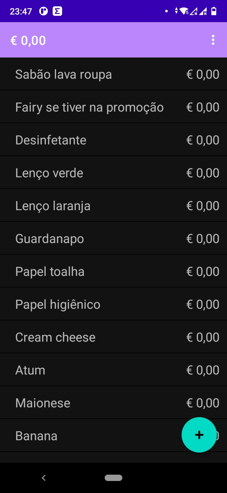

# Market List

> Application that handles a market list offline in device's storage system. The list can be just pasted in a big edit text field and the application creates all the products

### Future improvements

- [ ] Data validation
- [ ] UI improvement
- [ ] Tests implementation
- [ ] Dependency injection implementation

## 💻 Requirements

* Android 8.0

## 😄 Feel free to fork or open your PR 

## 📝 License

This project is under license. See [LICENSE FILE](LICENSE.md) for further details

[⬆ Back to top](#market-list) 